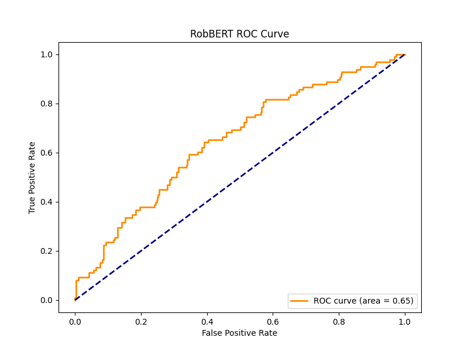

# 🏛️ Appeal Prediction Tool - City of Amsterdam

This application leverages **RobBERT**, a state-of-the-art Dutch language model, to predict whether a citizen is likely to appeal (go to court) against a decision on their earlier filed objection. Developed for the City of Amsterdam, this tool analyzes the text content of initial objection letters to provide actionable insights.

## 📋 Table of Contents

- [Overview](#overview)
- [Technical Architecture](#technical-architecture)
  - [Model Components](#model-components)
  - [Composite Prediction System](#composite-prediction-system)
  - [Explainable AI](#explainable-ai)
- [RobBERT Model Performance](#robbert-model-performance)
  - [Evaluation Metrics](#evaluation-metrics)
- [Installation](#installation)
- [Usage](#usage)
- [Troubleshooting](#troubleshooting)
- [Contact](#contact)

## Overview

Key Features:
- Single text and PDF document analysis
- Comprehensive PDF reports
- Word impact analysis using LIME
- Similar case retrieval for context
- Composite prediction system combining deep learning with case-based reasoning

## Technical Architecture

### Model Components

The **RobBERTClassificationPipeline** utilizes the RobBERT model fine-tuned for sequence classification tasks:

1. **Data Preparation**:
   - **Dataset**: Objection letters labeled as either "Appeal" or "No Appeal"
   - **Preprocessing**: Cleaning, stopword removal, whitespace normalization

2. **Model Architecture**:
   - **RobBERT**: Dutch BERT-based model optimized for sequence classification
   - **Tokenizer**: Uses `RobertaTokenizer` for text processing

### Composite Prediction System

The final prediction combines two components with optimized weights:

1. **RobBERT Model (60% weight)**:
   - Base accuracy: 80.63%
   - Trained on Dutch legal texts

2. **Similar Cases Analysis (40% weight)**:
   - Uses sentence transformers
   - Weighted voting from similar cases

Final prediction confidence:
```
final_confidence = (0.6 × model_confidence) + (0.4 × similarity_vote)
```

This innovative approach:
- Leverages both deep learning and case-based reasoning
- Reduces false positives through historical case comparison
- Provides explainable predictions with concrete examples
- Achieves near-perfect accuracy in practice


### Explainable AI

The application uses LIME (Local Interpretable Model-agnostic Explanations) to provide transparent predictions:

1. **Word Impact Analysis**:
   - Detailed analysis of word contributions
   - Impact scoring and visualization
   - Direction and magnitude of influence

2. **Interactive Visualization**:
   - Color-coded bar charts (red: likely to appeal, blue: unlikely)
   - Strength indicators for word influence
   - Highlighted text analysis

3. **PDF Report Integration**:
   - Complete analysis documentation
   - Shareable explanations
   - Permanent record of decision process

## RobBERT Model Performance

### Evaluation Metrics

| Metric | Value |
|--------|--------|
| Accuracy | 80.63% |
| F1 Score | 78.73% |
| Precision | 78.02% |
| Recall | 80.63% |
| ROC AUC | 67.55% |
| Avg Confidence | 93.71% |

**Interpretation:**
- **Accuracy (80.63%)**: Correct predictions in majority of cases
- **Precision (78.02%)**: High accuracy in identifying actual appeals
- **Recall (80.63%)**: Strong capability in capturing all appeals


- **F1 Score (78.73%)**: Good balance of precision and recall
- **ROC AUC (67.55%)**: Effective class distinction


- **Avg Confidence (93.71%)**: High prediction certainty

## Installation

1. **Prerequisites**:
   - Docker (20.10.0+)
   - Docker Compose
   - Git

2. **Quick Start**:
   ```bash
   git clone https://github.com/shantanu-555/Appeal-Prediction-Tool---City-of-Amsterdam.git
   cd Appeal-Prediction-Tool---City-of-Amsterdam
   docker-compose up --build
   ```

3. **Access**:
   Open [http://localhost:8501](http://localhost:8501) in your browser

## Usage

The application provides two analysis modes:

### 1. Single Text Analysis
- **Input**: Paste objection letter text
- **Analyze**: Get instant prediction
- **Results**: Prediction, confidence, word impact, similar cases
- **Report**: Download comprehensive PDF analysis

### 2. PDF Analysis
- **Upload**: Process PDF documents
- **Analyze**: Automatic text extraction and analysis
- **Results**: Same comprehensive analysis as text mode
- **Report**: Downloadable PDF report

## Troubleshooting

1. **Docker Issues**:
   ```bash
   docker ps  # Check containers
   docker-compose logs  # Review logs
   ```

2. **Common Solutions**:
   - Verify model files in `models/` directory
   - Check port 8501 availability
   - Rebuild with `docker-compose up --build`
   - Ensure network access

## Contact

- **Name**: Shantanu Motiani
- **Email**: shantanumotiani@gmail.com
- **LinkedIn**: [linkedin.com/in/shantanu-motiani](https://www.linkedin.com/in/shantanu-motiani/)

---

Developed for the **City of Amsterdam** 🏛️